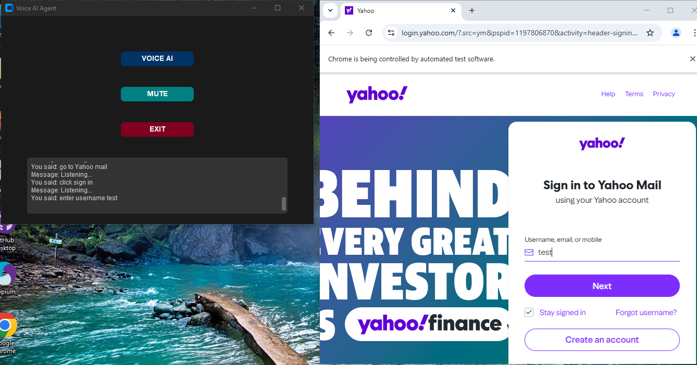

# Web Voice AI Agent (Executable Version)
# Overview

The Web Voice AI Agent is a voice-controlled tool that allows users to interact with web pages using voice commands. This executable version of the project provides a user-friendly interface for those who prefer not to deal with code or dependencies. Simply download, install, and start controlling web pages with your voice!

This AI-powered agent listens to your voice input, processes the commands, and performs corresponding actions on the web page, such as navigation, form filling, button clicking, and more. It’s perfect for hands-free web browsing and automation.
# Features

    Voice Command Recognition: Uses advanced speech-to-text technology to accurately interpret user commands.

    Web Automation: Performs actions like clicking, scrolling, filling forms, and navigating web pages.

    Pre-Built Executable: No need to install dependencies or set up a development environment.

    Cross-Platform Support: Works on Windows, macOS, and Linux (depending on the provided executable).

    Customizable Commands: Add or modify voice commands to suit your needs (via configuration files).

    User-Friendly Interface: Easy-to-use GUI for seamless interaction.
    

Web Automation AI Demo

https://youtu.be/aLuqJ8fyoAI?si=QKle09YthlCR755d

Example of Web Automation AI in action.
Installation

# Download

https://github.com/innovationprotolab/VoiceAIAgent/releases

# Getting Started
# Prerequisites

    Operating System: Windows, macOS, or Linux (ensure compatibility with the provided executable).

    Microphone: A working microphone for voice input.

    Modern Web Browser: Chrome, Firefox, or Edge (for web automation).

# Installation

    # Download the Executable:

        Download the latest release of the Web Voice AI Agent from the Releases page.

        Choose the appropriate executable for your operating system (e.g., .exe for Windows, .dmg for macOS, or .AppImage for Linux).

    # Install the Application:

        Windows: Double-click the .exe file and follow the installation wizard.

        macOS: Open the .dmg file and drag the application to your Applications folder.

        Linux: Make the .AppImage file executable (chmod +x filename.AppImage) and run it.

    # Launch the Application:

        Open the installed application from your desktop or applications menu.

    Grant Microphone Access:

        When prompted, allow the application to access your microphone.

# Usage

    # Start the Agent:

        Launch the Web Voice AI Agent and ensure your microphone is working.

    # Speak Commands:

        Use natural language to give commands. For example:

            "Open Google."

            "Click the login button."

            "Scroll down."

            "Search for AI articles."

            "Fill the form with name John and email john@example.com."

    View Actions:

        The agent will process your command and perform the corresponding action on the web page.

# Customizing Commands

You can customize the voice commands and actions by editing the configuration file (if supported by the executable). Look for a commands.json or similar file in the application's installation directory. Here’s an example of how to define custom commands:
json
Copy

[
  {
    "command": "open homepage",
    "action": "navigate_to_homepage"
  },
  {
    "command": "search for *",
    "action": "perform_search",
    "parameters": ["query"]
  }
]

Refer to the documentation or README included in the release for more details on customization.
# Troubleshooting

    Microphone Not Working: Ensure your microphone is properly connected and allowed in your system settings.

    Commands Not Recognized: Speak clearly and ensure your commands match the predefined or custom command list.

    Browser Compatibility Issues: Use a supported browser (Chrome, Firefox, or Edge) and ensure it’s up to date.

# Contributing

If you’re a developer and want to contribute to the project, you can check out the source code on GitHub:

    Fork the repository.

    Create a new branch for your feature or bugfix.

    Commit your changes.

    Submit a pull request with a detailed description of your changes.

For major changes, please open an issue first to discuss the proposed changes.
# License

This project is licensed under the MIT License. See the LICENSE file for details.
Acknowledgments

    Speech Recognition: Powered by Web Speech API or similar services.

    Web Automation: Built with Puppeteer or browser-native APIs.

    Executable Packaging: Made possible by tools like Electron or PyInstaller.

# Contact

For questions, feedback, or support, please reach out to:

    JC

    Email: mailtojosh5@gmail.com

    GitHub: innovationprotolab

# Enjoy using the Web Voice AI Agent! 🚀
